# EnginarUpdate Plugin — v1.1 (EnginarUpdate)

A [Paper](https://papermc.io/) plugin for Minecraft **26.1.2** that reworks combat balance,
mob loot, item mending, crafting recipes, and ore world generation for the EnginarCraft
server. This document describes **every single change** the plugin makes, always compared
against unmodified vanilla behavior, in the order a player would actually encounter them.

Every "vanilla" number quoted below is either taken verbatim from the plugin's own source
comments, or was verified directly against real Minecraft 26.1 vanilla data (world-gen JSON,
loot tables, and recipes) — nothing here is guessed.

## Table of contents

1. [Combat & mob balance](#1-combat--mob-balance)
2. [Loot & drops](#2-loot--drops)
3. [Mending & Elytra](#3-mending--elytra)
4. [Crafting & the Netherite economy](#4-crafting--the-netherite-economy)
5. [World generation](#5-world-generation)
6. [Beacon](#6-beacon)
7. [The End](#7-the-end)
8. [Utility & misc](#8-utility--misc)
9. [Full recipe index](#9-full-recipe-index)

---

## 1. Combat & mob balance

### Mob health

`MobHealthListener` overwrites max health on spawn for a long list of mobs. Baby zombies are
now notably *weaker* than adults, which is a reversal of vanilla (where they're equally
tanky) — everything else on the list got a straight buff, some drastically so (Blaze is 10×
tougher, Ender Dragon is 5×):

| Mob | Vanilla HP | New HP | Change |
|---|---:|---:|---:|
| Zombie (adult) | 20 | 24 | +20% |
| Zombie (baby) | 20 | 12 | **−40%** |
| Piglin | 16 | 24 | +50% |
| Piglin Brute | 50 | 100 | ×2 |
| Enderman | 40 | 100 | ×2.5 |
| Blaze | 20 | 200 | **×10** |
| Witch | 26 | 120 | ×4.6 |
| Vindicator | 24 | 30 | +25% |
| Pillager | 24 | 30 | +25% |
| Evoker | 24 | 30 | +25% |
| Vex | 14 | 17.5 | +25% |
| Ravager | 100 | 125 | +25% |
| Illusioner | 32 | 40 | +25% |
| Ender Dragon | 200 | 1000 | **×5** |
| Wither | 300 | 600 | ×2 |

All values apply on spawn; a mob that was already alive when the plugin loaded is unaffected
until it respawns.

### Damage changes

- **Blaze melee damage**: 6.0 → 12.0 (+100%), applied alongside the health buff above.
- **Skeleton arrows**: plain Skeletons (not Stray, not Wither Skeleton) now deal ×0.75
  damage (−25%) with every arrow — a small nerf to the game's most common ranged threat.
- **Shulker bullets**: on hit, now apply **Poison I for 10 seconds** in addition to vanilla's
  Levitation effect — getting shot by a Shulker is meaningfully more dangerous now.

### Enderman behavior

Endermen can no longer pick up or place any block at all. Vanilla lets them grab specific
blocks (dirt, grass, sand, various ores, TNT, pumpkins, etc.) and drop them elsewhere; that's
fully disabled here — no more Enderman-induced terrain vandalism.

### Witch combat rework

Vanilla Witches just walk up and throw potions. Here, while a Witch has an active target, every
**3 seconds** it:

- Teleports Chorus-Fruit-style (short random hop, always to a safe landing spot), **healing
  itself 4 HP** on every successful teleport.
- Applies **Blindness for 5 seconds** to its target.

Independently of that cycle, every **5 seconds** while it has a target it also refreshes
**Swiftness II** on itself for **10 seconds** — since the refresh interval is shorter than the
duration, the speed boost never actually lapses for as long as the fight continues.

Ranged kiting is blunted too: every time a Witch is hit by an arrow, it **heals 4 HP** back one
tick after the damage lands.

A dedicated purple boss bar tracks the Witch's remaining health for **every online player**, not
just whoever it's fighting — vanilla has no boss bar for Witches at all. It becomes visible
whenever *any* player is within **25 blocks** of the Witch (showing "fighting `<name>`" if it
actually has a target, or just "Witch" if someone's merely nearby), and hides again once no one
is in range or the Witch is gone.

This makes Witches genuinely evasive, disorienting, and self-sustaining fights instead of a
stationary potion-lobbing fight. Vanilla has no equivalent mechanic for any mob.

### Blazes now roam the open Nether

This one isn't documented anywhere in the plugin's code comments — it only shows up as a diff
against the bundled world-gen data — but it's a significant change: **Blazes now spawn
naturally outside of Nether Fortresses.** Vanilla Blazes are 100% fortress-spawner-bound; they
never appear via ambient biome spawning. The bundled datapack adds a `minecraft:blaze` natural
spawn entry to three Nether biomes:

| Biome | Spawn weight | Group size |
|---|---:|---:|
| Basalt Deltas | 20 | 2–4 |
| Nether Wastes | 5 | 1–2 |
| Soul Sand Valley | 5 | 1–1 |

Basalt Deltas gets by far the heaviest presence — expect Blazes to be a common, ambient hazard
there now, not something you only meet inside a fortress.

---

## 2. Loot & drops

### Enderman

| | Vanilla | Plugin |
|---|---|---|
| Ender Pearl | uniform 0–1 roll (~50% effective), +Looting bonus roll per level | flat **20%** chance of exactly 1, **+1% per Looting level** |
| XP | 5 | **0** |

Net effect: pearls are noticeably rarer per kill, and Endermen no longer grant XP at all.

### Blaze

| | Vanilla | Plugin |
|---|---|---|
| Blaze Rod | uniform 0–1 roll (~50% effective, player-kill only), +Looting bonus | flat **5%** chance of 1, **+1% per Looting level** |
| Blaze Powder | *(not a direct drop — only ever crafted from rods)* | **new**: flat 5% chance of 1–2, **+1% per Looting level** |
| XP | 10 | **20** (×2) |
| Kill reward | none | Regeneration II for 10s + Fire Resistance I for 3s |

Blaze Rods got a heavy nerf (~50% → 5%), but Blaze Powder can now drop directly, XP is
doubled, and killing a Blaze grants the killer a free combat buff — a very different
risk/reward profile than vanilla, especially now that Blazes roam the open Nether (§1).

### Witch

Vanilla Witches drop 1–3 rolls from a shared pool of Glowstone Dust, Sugar, Spider Eye, Glass
Bottle, and Gunpowder (0–2 each, Looting-boosted, Stick has double weight in that pool), plus a
guaranteed separate roll of 4–8 Redstone (also Looting-boosted). This plugin **replaces the
entire table**:

| | Vanilla | Plugin |
|---|---|---|
| Ender Eye | *(not a drop)* | **new**: 1.25% chance of exactly 1 |
| Chorus Fruit | *(not a drop)* | **new**: 1–4, guaranteed at least one |
| Enchanted Book | *(not a drop)* | **new**: 1–2, each with a fully random enchantment (any enchantment in the game, including treasure/curse ones) at a random valid level for that enchantment |
| Glowstone Dust, Sugar, Spider Eye, Glass Bottle, Gunpowder, Stick, Redstone | vanilla rolls (see above) | **removed entirely** |

Every Witch kill is now a guaranteed source of Chorus Fruit and at least one random Enchanted
Book — a concentrated, "worth hunting" loot table, at the cost of every vanilla Witch drop.

### Chest loot

These items are stripped out entirely, server-wide, from **every loot-table-driven drop** the
plugin can see — not just structure chests (Bastion Remnants, Ancient Cities, etc.), but any
source that goes through Bukkit's generic loot-generation hook, including fishing:

- Netherite Ingot
- Ancient Debris
- Netherite Scrap
- Netherite Upgrade Smithing Template

Vanilla finds all four of these in structure loot. Here, none of them can be looted — every
gram of Netherite gear has to be earned through mining and crafting (see §4 for the full
chain this creates).

### Nether Gold Ore

- Gold Nugget drop count: vanilla 2–6 → **1–2**. Fortune still adds +1 to the maximum per
  level; Silk Touch still preserves the block as-is.
- The ore itself also spawns half as often per chunk now (§5) — this is a drop-rate nerf
  *and* an availability nerf stacked on top of each other.

---

## 3. Mending & Elytra

- **Mending repair ratio**: vanilla repairs 2 durability per XP point absorbed; the plugin
  changes this to a flat **1:1** (1 XP = 1 durability) — Mending items now repair at half
  the rate for the same amount of XP absorbed.
- **Elytra can no longer receive Mending** through the Enchanting Table or the Anvil — both
  paths are actively blocked. This makes a Mending Elytra impossible to get through normal
  enchanting entirely.
- The *only* way to get a Mending-enchanted Elytra is a single, deliberately exotic crafting
  recipe — see the "Mending Elytra" entry in §4/§9. It is the sole sanctioned exception to
  the ban above.

---

## 4. Crafting & the Netherite economy

This is the plugin's largest and most interconnected change, so it's worth reading as one
continuous chain rather than a list of isolated recipes.

### The full progression path

With Ancient Debris, Netherite Scrap, and the Netherite Upgrade Smithing Template all removed
from chest loot (§2), Netherite gear now has exactly one route, start to finish:

1. **Mine Ancient Debris** in the Nether (rarer now — §5) and smelt it into Netherite Scrap.
2. **Craft a Netherite Ingot** the vanilla way — 4 Netherite Scrap + 4 Gold Ingot, shapeless.
   This recipe is untouched.
3. **Craft a Netherite Upgrade Smithing Template.** Vanilla only offers this via loot plus a
   duplication recipe (Template + 7 Diamond + Netherrack → 2 Templates); both of those vanilla
   recipes are removed. The only remaining source is a brand-new recipe:

   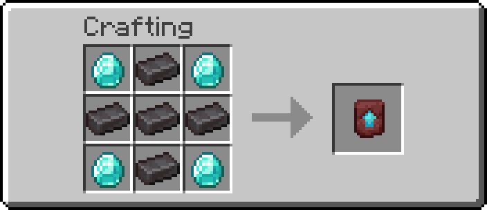

4. From here, **two parallel paths** to actual Netherite gear now exist (vanilla only ever
   had the second one):

   - **New — direct crafting.** Full Netherite armor can now be crafted straight from
     Netherite Ingots using the same shapes as Diamond armor; Netherite tools and the sword
     use Netherite Ingot + **Blaze Rod**. None of this has any vanilla equivalent — vanilla
     has no crafting-table recipe for Netherite gear at all, only the Smithing Table upgrade.
   - **Changed — Smithing Table upgrade.** The classic Diamond-gear-plus-Template upgrade
     still exists for all 10 gear pieces, but the "addition" material is now **Blaze Rod
     instead of Netherite Ingot.**

     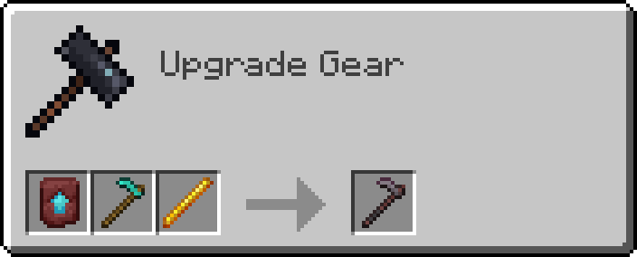

     *(All 10 armor/tool pairs use this same Template + Diamond-piece + Blaze Rod layout —
     see the full list in §9.)*

### New direct Netherite recipes

<table>
<tr>
<td align="center">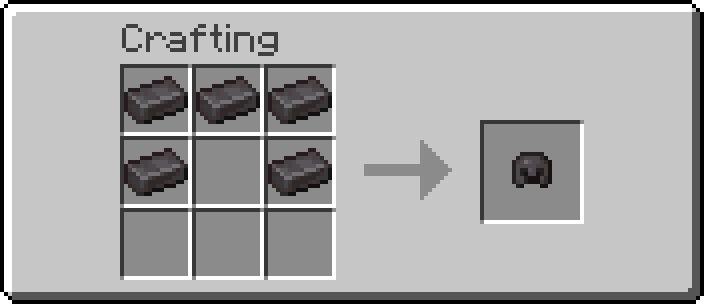<br><b>Netherite Helmet</b><br>5 Netherite Ingot</td>
<td align="center">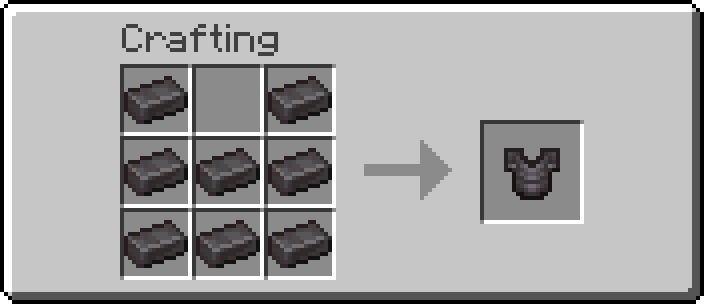<br><b>Netherite Chestplate</b><br>8 Netherite Ingot</td>
</tr>
<tr>
<td align="center">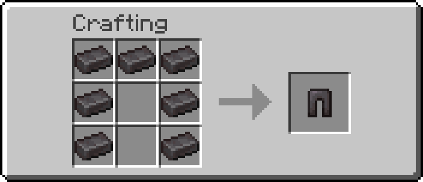<br><b>Netherite Leggings</b><br>7 Netherite Ingot</td>
<td align="center">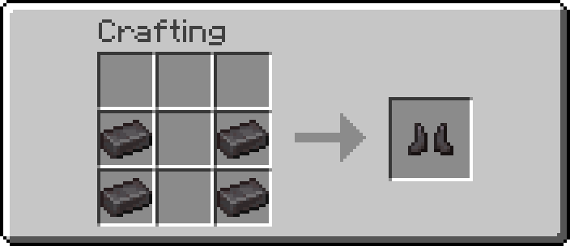<br><b>Netherite Boots</b><br>4 Netherite Ingot</td>
</tr>
<tr>
<td align="center">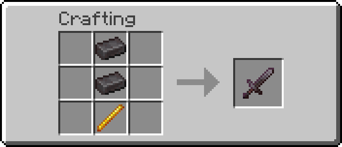<br><b>Netherite Sword</b><br>2 Ingot + 1 Blaze Rod</td>
<td align="center">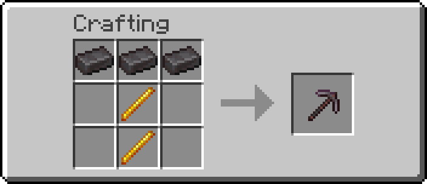<br><b>Netherite Pickaxe</b><br>3 Ingot + 2 Blaze Rod</td>
</tr>
<tr>
<td align="center">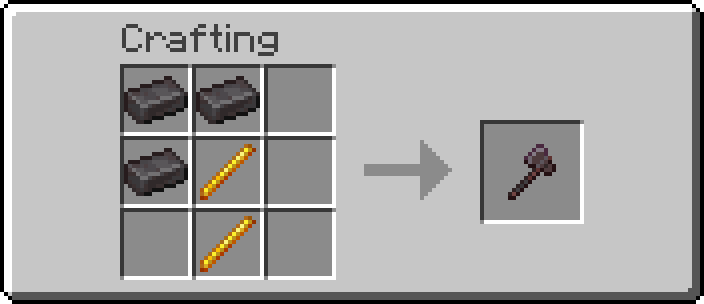<br><b>Netherite Axe</b><br>3 Ingot + 2 Blaze Rod</td>
<td align="center">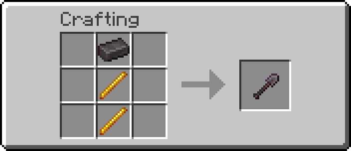<br><b>Netherite Shovel</b><br>1 Ingot + 2 Blaze Rod</td>
</tr>
<tr>
<td align="center">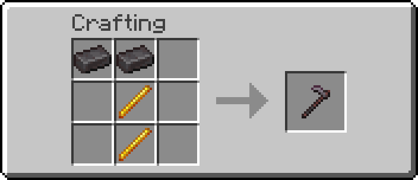<br><b>Netherite Hoe</b><br>2 Ingot + 2 Blaze Rod</td>
<td align="center">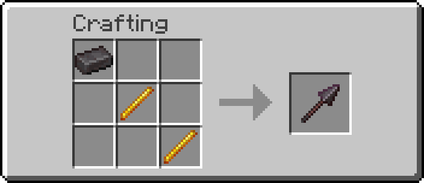<br><b>Netherite Spear</b><br>1 Ingot + 2 Blaze Rod</td>
</tr>
</table>

### Other recipe changes

- **Ender Eye** — vanilla is a trivial 2-ingredient shapeless recipe (1 Ender Pearl + 1 Blaze
  Powder). Replaced with an 8-item shaped recipe, gated behind Nether/End-adjacent materials:

  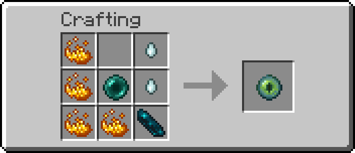

  4 Blaze Powder + 2 Ghast Tear + 1 Ender Pearl + 1 Echo Shard → 1 Ender Eye.

- **Book** — vanilla is shapeless, 3 Paper + 1 Leather → 1 Book. Replaced with a shaped recipe
  that's actually *cheaper per book*:

  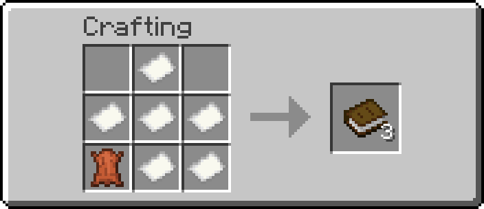

  6 Paper + 1 Leather → **3 Books** (2 Paper and ≈0.33 Leather per book, down from 3 and 1).
  A quiet buff to the enchanting economy (Bookshelves and Book & Quills both need Books).

- **Beacon** — vanilla is 5 Glass + 1 Nether Star + 3 Obsidian. Replaced with a pricier recipe
  that adds a second Nether Star and a whole Diamond Block:

  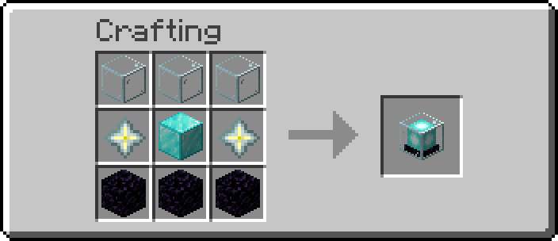

  3 Glass + **2 Nether Star** + 1 Diamond Block + 3 Obsidian → 1 Beacon. This directly offsets
  the beacon effect-range buff in §6 — the payoff is bigger, so the entry price went up too.

- **Wind Charge** — vanilla already has a recipe (1 Breeze Rod → 4 Wind Charges) and it is
  **not removed**. The plugin adds a second, alternate recipe alongside it:

  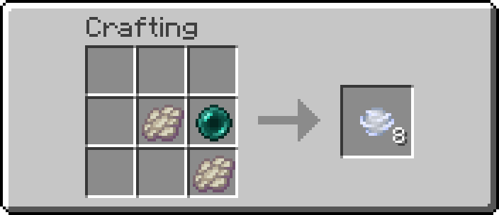

  2 Phantom Membrane + 1 Ender Pearl → **8 Wind Charges**. Both recipes are now craftable.

- **Spawn eggs** — vanilla spawn eggs are creative-inventory/command-only; there is no
  survival crafting path for any of them. This plugin adds three:

  <table>
  <tr>
  <td align="center">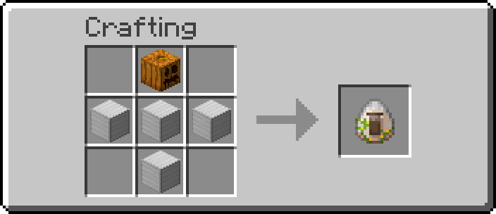<br><b>Iron Golem Spawn Egg</b><br>1 Carved Pumpkin + 4 Iron Block</td>
  <td align="center">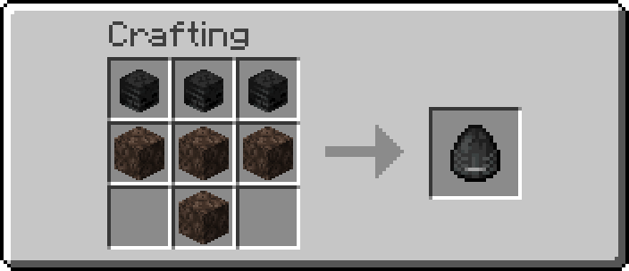<br><b>Wither Spawn Egg</b><br>3 Wither Skeleton Skull + 4 Soul Sand</td>
  </tr>
  <tr>
  <td align="center" colspan="2">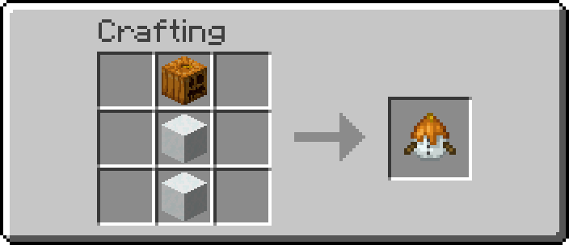<br><b>Snow Golem Spawn Egg</b><br>1 Carved Pumpkin + 2 Snow Block</td>
  </tr>
  </table>

- **Mending Elytra** — the secret, deliberately extravagant end-game recipe, and the *only*
  sanctioned way to get Mending on an Elytra (§3):

  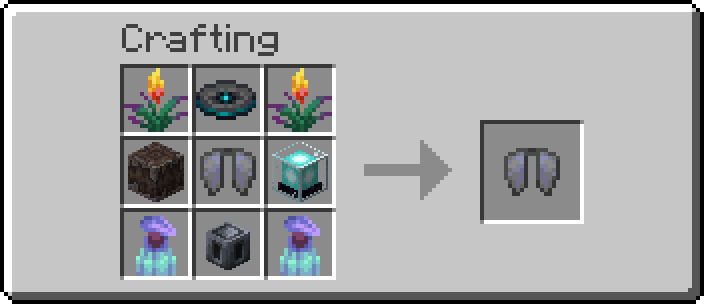

  2 Torchflower + 1 Music Disc 5 + 1 Creaking Heart + 1 Elytra + **1 Beacon** + 2 Pitcher Plant
  + 1 Heavy Core → 1 Mending Elytra. It consumes an entire crafted Beacon as an ingredient —
  by the time you can afford this recipe, you've already built the economy in §4 and §6 from
  the ground up.

---

## 5. World generation

The plugin ships a bundled datapack (`enginarupdate_oregen`) that overrides diamond, ancient
debris, and gold ore generation. All numbers below are verified against real Minecraft 26.1
vanilla world-gen data — not estimated.

### Diamond ore

Every vein *size* is cut in half; the "buried" vein (the safest, most reliable source —
fully underground, air-exposure discard chance 100%) also lost most of its spawn frequency:

| Vein type | Vanilla size | New size | Vanilla frequency | New frequency |
|---|---:|---:|---:|---:|
| Small | 4 | **2** | 7/chunk | 6/chunk |
| Medium | 8 | **4** | 2/chunk (Y −64 to −4) | unchanged |
| Large | 12 | **6** | 1-in-9 chunks | unchanged |
| Buried | 8 | unchanged | 4/chunk | **1/chunk** |

The buried-vein cut (4→1) is the single biggest nerf here — the classic "strip-mine at
Y=−59" strategy, which relied heavily on buried veins, now yields far fewer diamonds per
trip. Combined with every vein being half-size, diamonds are substantially harder to
stockpile than in vanilla.

### Ancient Debris

| Vein type | Vanilla size | New size | Vanilla frequency | New frequency |
|---|---:|---:|---:|---:|
| Small | 2 | **1** | ~1/chunk (implicit) | **2/chunk** |
| Large | 3 | **2** | ~1/chunk, Y 8–24 | unchanged |

Both vein sizes shrink, but the small vein spawns twice as often to partially compensate —
net effect is more scattered single/double-block finds rather than the occasional bigger
clump vanilla produces.

### Gold Ore — now Badlands-exclusive

The datapack removes **both** vanilla gold ore features (`ore_gold` and `ore_gold_lower`)
from all 51 overworld/underground biomes it touches — every biome from Plains to Lush Caves
to Jungle loses regular gold ore generation entirely. Badlands, Eroded Badlands, and Wooded
Badlands are **not** included in the datapack, so they're completely untouched — meaning
gold ore (including vanilla's Badlands-exclusive bonus vein) now generates **only** in
Badlands-family biomes. If you want gold, you go to the Badlands now; that's the *only* place
left.

### Nether Gold Ore

Per-chunk spawn frequency is halved: vanilla 10 attempts/chunk → **5 attempts/chunk**, in
Nether Wastes, Crimson Forest, Warped Forest and Soul Sand Valley (Basalt Deltas uses its own separate `ore_gold_deltas`
feature, which is untouched). Combined with the nugget-drop nerf in §2, Nether Gold Ore is
both rarer to find *and* less rewarding to mine than in vanilla.

---

## 6. Beacon

| Tier | Vanilla range | New range |
|---:|---:|---:|
| 1 | 20 | **30** |
| 2 | 30 | **45** |
| 3 | 40 | **60** |
| 4 | 50 | **75** |

Range is refreshed continuously (every 2 seconds) and also on placement, breakage, chunk
load, and effect changes — so the buff applies retroactively to beacons that were already
built before the plugin was installed. No change to the pyramid-material tier requirements;
this reuses Bukkit's own tier detection as-is. The effect itself is still fully **shared** —
exactly like vanilla, everyone standing in range benefits, there is no per-owner restriction.
The much bigger range is paid for with a much bigger recipe cost — see §4.

---

## 7. The End

### End Crystals fight back differently

While the Ender Dragon is alive:

- End Crystals **cannot** be destroyed by projectiles or explosions at all — only by direct
  player melee hits.
- It takes **3 consecutive hits** to pop one, with a 10-second cooldown after each hit. This
  cooldown is **global to the crystal**, not personal — while it's active, *no* player (not
  just whoever landed the hit) can damage that crystal again.
- Every hit spawns a 5-block-radius Instant-Damage cloud, centered **one block below** the
  crystal, for 8 seconds (re-applying roughly once a second) — standing near a crystal you're
  attacking is now genuinely dangerous, and the cloud affects everyone inside it, attacker
  included.
- The 3rd hit detonates the crystal (vanilla-strength explosion) plus **5 random lightning
  strikes** nearby for effect.

Once the dragon dies, End Crystals immediately revert to fully vanilla, instant-pop behavior
— this entire system is dragon-fight-specific.

### The arena won't let you hide

While the Ender Dragon is alive, every non-spectator player in the End is auto-teleported
every 10 seconds to a random safe spot, Chorus-Fruit style — but the destination is always
constrained to within 100 blocks of the Main Island. Vanilla never repositions the player;
this exists specifically to stop players from cheesing the fight by camping on the outer
End islands.

---

## 8. Utility & misc

- **`/engcount <block_id>`** — OP-only. Counts how many blocks of the given type exist in
  the full Y-range of the chunk the player is standing in. Registered via Paper's Brigadier
  command API at plugin bootstrap time.
- **Bilingual messages** — every player-facing message the plugin sends (command feedback,
  permission errors, etc.) automatically switches between English and Turkish based on the
  player's client locale, independent of which language this document is read in.

---

## 9. Full recipe index

All 19 new/changed crafting-table recipes, plus all 10 Smithing Table upgrade recipes.

### Crafting table

| Recipe | Image |
|---|---|
| Netherite Helmet | [`netherite_helmet.png`](assets/recipes/netherite_helmet.png) |
| Netherite Chestplate | [`netherite_chestplate.png`](assets/recipes/netherite_chestplate.png) |
| Netherite Leggings | [`netherite_leggings.png`](assets/recipes/netherite_leggings.png) |
| Netherite Boots | [`netherite_boots.png`](assets/recipes/netherite_boots.png) |
| Netherite Sword | [`netherite_sword.png`](assets/recipes/netherite_sword.png) |
| Netherite Pickaxe | [`netherite_pickaxe.png`](assets/recipes/netherite_pickaxe.png) |
| Netherite Axe | [`netherite_axe.png`](assets/recipes/netherite_axe.png) |
| Netherite Shovel | [`netherite_shovel.png`](assets/recipes/netherite_shovel.png) |
| Netherite Hoe | [`netherite_hoe.png`](assets/recipes/netherite_hoe.png) |
| Netherite Spear | [`netherite_spear.png`](assets/recipes/netherite_spear.png) |
| Netherite Upgrade Smithing Template | [`netherite_upgrade_smithing_template.png`](assets/recipes/netherite_upgrade_smithing_template.png) |
| Ender Eye (replaces vanilla) | [`ender_eye.png`](assets/recipes/ender_eye.png) |
| Book (replaces vanilla) | [`book.png`](assets/recipes/book.png) |
| Beacon (replaces vanilla) | [`beacon.png`](assets/recipes/beacon.png) |
| Wind Charge (alternate, vanilla kept) | [`wind_charge.png`](assets/recipes/wind_charge.png) |
| Iron Golem Spawn Egg (new) | [`iron_golem_spawn_egg.png`](assets/recipes/iron_golem_spawn_egg.png) |
| Wither Spawn Egg (new) | [`wither_spawn_egg.png`](assets/recipes/wither_spawn_egg.png) |
| Snow Golem Spawn Egg (new) | [`snow_golem_spawn_egg.png`](assets/recipes/snow_golem_spawn_egg.png) |
| Mending Elytra (secret recipe) | [`mending_elytra.png`](assets/recipes/mending_elytra.png) |

### Smithing table (Diamond → Netherite, addition = Blaze Rod)

| Recipe | Image |
|---|---|
| Helmet | [`smithing_diamond_helmet.png`](assets/recipes/netherite_helmet_smithing.png) |
| Chestplate | [`smithing_diamond_chestplate.png`](assets/recipes/netherite_chestplate_smithing.png) |
| Leggings | [`smithing_diamond_leggings.png`](assets/recipes/netherite_leggings_smithing.png) |
| Boots | [`smithing_diamond_boots.png`](assets/recipes/netherite_boots_smithing.png) |
| Sword | [`smithing_diamond_sword.png`](assets/recipes/netherite_sword_smithing.png) |
| Pickaxe | [`smithing_diamond_pickaxe.png`](assets/recipes/netherite_pickaxe_smithing.png) |
| Axe | [`smithing_diamond_axe.png`](assets/recipes/netherite_axe_smithing.png) |
| Shovel | [`smithing_diamond_shovel.png`](assets/recipes/netherite_shovel_smithing.png) |
| Hoe | [`smithing_diamond_hoe.png`](assets/recipes/netherite_hoe_smithing.png) |
| Spear | [`smithing_diamond_spear.png`](assets/recipes/netherite_spear_smithing.png) |

---

## Building

```
mvn clean package
```

Requires JDK 25 and Paper API `26.1.2.build` or newer (resolved from the PaperMC Maven
repository). The built jar is in releases.